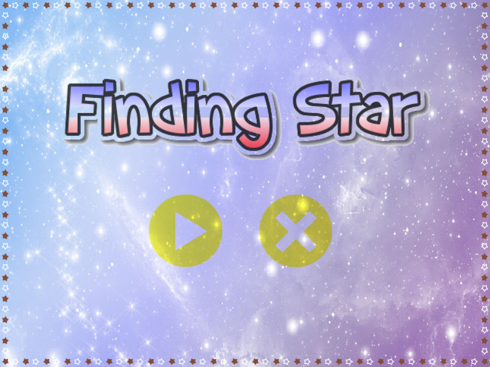
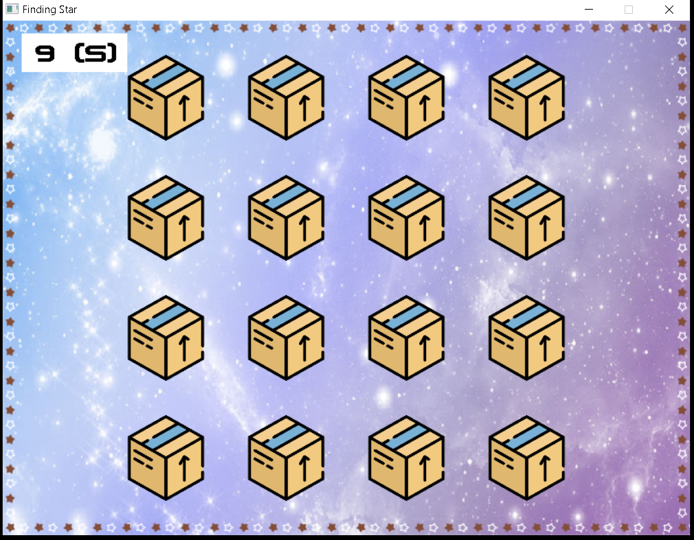
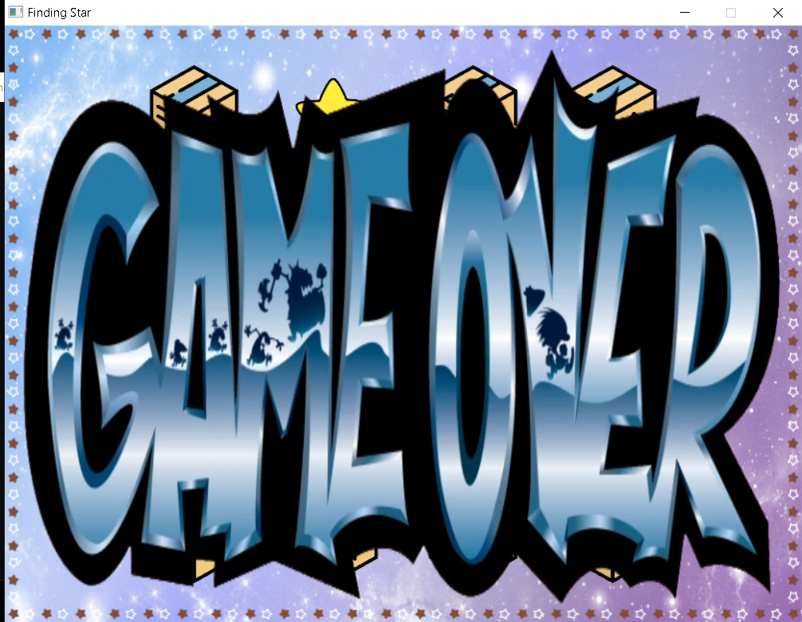
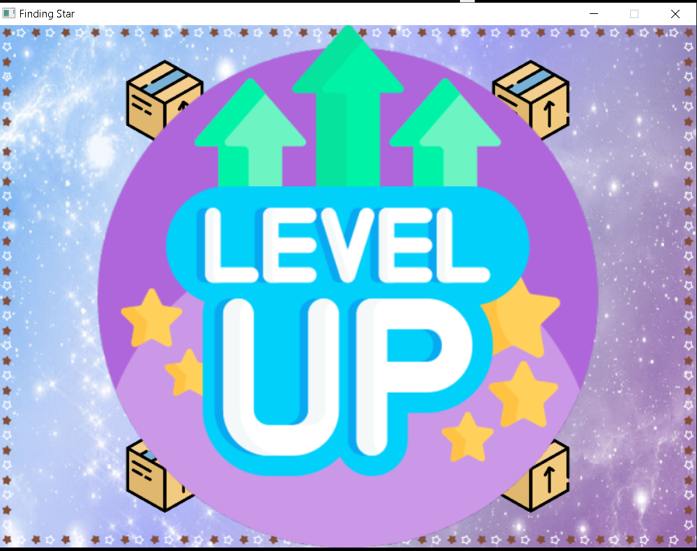
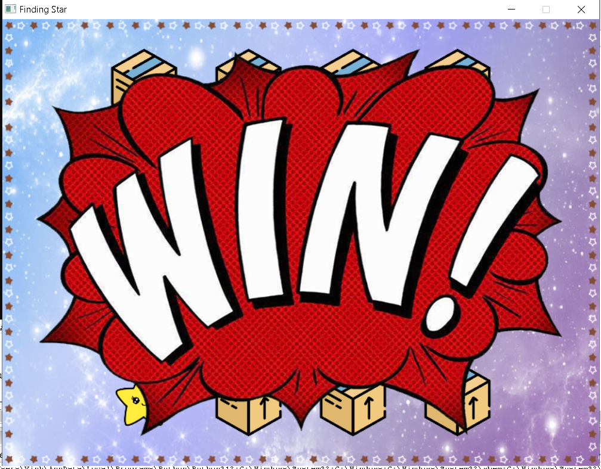

# Finding Star

- Demo game: [https://drive.google.com/file/d/1lw7_BsbGNd98uzzLTWCk6i7mQC34Mf68/view?usp=sharing](https://drive.google.com/file/d/1lw7_BsbGNd98uzzLTWCk6i7mQC34Mf68/view?usp=sharing)

# Giới thiệu game

Finding Star là game bao gồm một bảng gồm 4x4 hộp, bên trong sẽ chứa ngẫu nhiên 2 ngôi sao. Sau khi trò chơi thực hiện đảo ngẫu nhiên vị trí các hộp, người chơi cần chọn đúng 2 hộp có chứa ngôi sao đó. 

# 0. Cách tải game

## a. Bước 1: Cài đặt SDL vào trình biên dịch Code Block.

## b. Bước 2: Tải repo này về máy.

# 1. Bắt đầu game

- Bắt đầu, chương trình hiện start menu bao gồm 2 phím cho người lựa chọn. Phím bên trái cho phép người chơi bắt đầu chơi, phím bên phải cho phép người chơi thoát khỏi trò chơi.

- Khi người chơi chọn bắt đầu chơi, màn hình hiện bảng gồm 4x4 hộp. Sau đó trò chơi thực hiện tráo đổi ngẫu nhiên các hộp và yêu cầu người chơi tìm ra 2 hộp có chứa 2 ngôi sao. Sẽ có giới hạn thời gian là 10s cho mỗi màn. Đây là khoảng thời gian để người chơi tìm ra 2 hộp đó.

- Nếu người chơi chọn sai hộp hoặc sau khi hết thời gian đếm ngược mà người chơi chưa tìm đủ và đúng 2 hộp có chứa ngôi sao. Người chơi sẽ nhận thông báo thua cuộc. 

- Nếu người chơi chọn đúng hộp và thời gian đếm ngược vẫn còn. Người chơi sẽ nhận thông báo lên màn. Trò chơi có tổng cộng 5 màn. Màn càng cao thì game càng khó. Khi chiến thắng hết 5 màn. Người chơi sẽ nhận thông báo thắng cuộc. 

- Dù người chơi thắng hay thua, thì game sẽ đều đưa người chơi về start menu để có thể cho phép người chơi chơi lại hoặc thoát khỏi trò chơi

# 2. Cách chơi

Người chơi chỉ cần double click vào hộp muốn chọn. Còn lại mọi thứ đều do chương trình tự thực hiện.

# 3. Những tài nguyên của chương trình:

- Hình ảnh:
    * start menu: menu bắt đầu trò chơi
    * background: nền của trò chơi
    * box: hộp chứa ngôi sao
    * star: ngôi sao cần tìm
    * game-over: thông báo thua cuộc
    * level-up: thông báo lên màn
    * winners: thông báo thắng cuộc

- Âm thanh:
    * background: nhạc nền của trò chơi
    * game-over: âm thanh thông báo thua cuộc
    * winners: âm thanh thông báo thắng cuộc

- Phông chữ:
    * font: chứa phông chữ sử dụng trong trò chơi.
- Các tài nguyên sử dụng trong game đều được lấy từ các nguồn trên Internet.

# 4. Những cải tiến đã làm được so với ý tưởng ban đầu

- Nâng cấp về âm thanh và đồ họa cho Game.

- Nâng cấp độ khó cho Game bao gồm: làm cho game đảo hộp nhanh hơn và đảo nhiều lần hơn.

- Thêm tính năng bộ đếm ngược thời gian để nâng cấp thêm về độ khó.

- Nâng cấp hàm tráo đổi hộp để game tráo đổi hộp thông minh và khó đoán hơn.

- Cuối cùng, cho phép người chơi chơi lại mỗi khi thua hoặc thắng.

# 5. Các file quan trọng của chương trình

- Main.cpp: Khởi tạo các thành phần đồ họa và âm thanh, tải các tài nguyên như hình ảnh và âm thanh, sau đó thực hiện trò chơi, bao gồm hiển thị giao diện, xử lý sự kiện, đếm ngược thời gian và xác định kết quả dựa trên lựa chọn của người chơi.

- ShowFull.cpp: Hiển thị menu bắt đầu, hiển thị bảng trò chơi với các hộp và ngôi sao, thực hiện các hiệu ứng chuyển đổi khi các hộp bị tráo đổi hoặc khi có sự kiện đặc biệt, và hiển thị thông báo chiến thắng hoặc thua cuộc khi kết thúc trò chơi.

- Generate.cpp: Tạo bảng với các vị trí ngôi sao ngẫu nhiên, sau đó tráo đổi vị trí của hộp theo các hướng khác nhau trên bảng. 

- ShowFull.h và Generate.h: Định nghĩa các hàm của chương trình.

---

